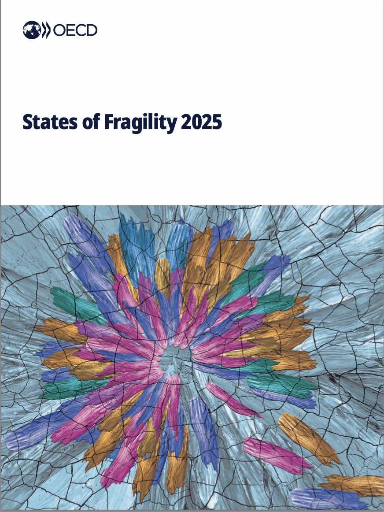

# Hi, I'm Leila 👋

I have experience in project management, PMO, data analysis and business transformation across international and financial environments.

My background includes IT project portfolio management, risk monitoring, executive reporting, KPI tracking and data-driven dashboard development to support decision-making.

## 💼 Areas of Expertise

- Project & Portfolio Management
- PMO & Project Governance
- Risk Management
- KPI & Executive Reporting
- Data Analysis & Dashboarding
- Stakeholder Coordination
- Agile, Scrum & Kanban
- Digital Transformation

## 🛠️ Tools & Methodologies

**Project Management:** Jira · Confluence · MS Project · Oracle Primavera

**Data & Analytics:** Excel · Python · R / RStudio · Stata

**Methodologies:** Agile · Scrum · Kanban · Waterfall · Hybrid Project Management

---

## 📊 Featured Work

### 🌎 OECD — Responsible Business Conduct in Latin America & the Caribbean

Interactive data dashboard developed during my experience at the Organisation for Economic Co-operation and Development (OECD) as part of the **2025 Survey on Responsible Business Conduct in Latin America and the Caribbean**.

The dashboard presents survey results across Latin America and the Caribbean and provides insights into companies' practices, awareness and challenges related to responsible business conduct and due diligence.

**My contribution:** Data Analysis · Dashboard Development · Data Visualization · Reporting

**Scope:** 526 businesses · 26 countries · 13 sectors

🔗 **[View the OECD Dashboard →](https://www.oecd.org/en/data/dashboards/results-of-the-2025-survey-on-responsible-business-conduct-in-latin-america-and-the-caribbean.html)**

---

### 🇬🇹 OECD — Responsible Business Conduct in Guatemala

Country-level dashboard developed during my experience at the **OECD**, focusing on responsible business conduct practices among companies operating in Guatemala.

The dashboard provides an interactive overview of survey results and allows users to explore responsible business conduct and due diligence practices according to company characteristics.

**My contribution:** Data Analysis · Dashboard Development · Data Visualization · Reporting

**Scope:** 59 businesses operating in Guatemala

🔗 **[View the Guatemala Dashboard →](https://www.oecd.org/en/data/dashboards/results-of-the-2025-survey-on-responsible-business-conduct-in-latin-america-and-the-caribbean/guatemala.html)**

---

## 📚 Publications & Research

### 🌍 OECD — States of Fragility 2025

  

I contributed to the **OECD's States of Fragility 2025**, a flagship report examining global fragility, conflict, development and resilience through the OECD's multidimensional fragility framework.

Published by **OECD Publishing** in February 2025, the report analyses fragility across political, economic, environmental, security, societal and human dimensions.

📖 **[View the publication →](https://www.oecd.org/en/publications/states-of-fragility-2025_81982370-en.html)**

📄 **[Read the full report (PDF) →](https://www.oecd.org/content/dam/oecd/en/publications/reports/2025/02/states-of-fragility-2025_c9080496/81982370-en.pdf)**

---
### ✈️ Clearing the Air: Lessons from the EU ETS for Low Carbon Aviation

**Council on Economic Policies (CEP) · March 2025**

Co-authored with **Patrick Lenain**, this article examines the role of carbon pricing in the decarbonisation of aviation and draws lessons from the **European Union Emissions Trading System (EU ETS)**.

The analysis explores how carbon pricing can influence airline behaviour, fleet efficiency and aviation emissions, as well as the implications of extending carbon pricing mechanisms.

**Authors:** Patrick Lenain & Leila Sahib

**Topics:** Carbon Pricing · EU ETS · Sustainable Aviation · Climate Policy · Decarbonisation

✍️ **[Read the article on the Council on Economic Policies →](https://www.cepweb.org/clearing-the-air-lessons-from-the-eu-ets-for-low-carbon-aviation/)**

---

## 🎓 Education

**MBA in International Business**  
TU Bergakademie Freiberg

**Master's Degree in Economic Development & Management**  
Université Gustave Eiffel · Université Paris-Est Créteil

**Bachelor's Degree in Economics & International Management**  
Université Paris-Est Créteil · University of Bologna

---

## 🌍 Languages

**French:** Native  
**Italian:** Native  
**English:** C1  
**Spanish:** B2  
**Arabic:** B2  
**German:** A2
